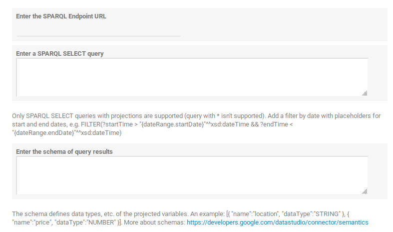

# SPARQL Connector for Google Data Studio

It allows to load data from a SPARQL endpoint using the SELECT queries.

## Getting started

1. Open the [link](https://datastudio.google.com/datasources/create?connectorId=AKfycbzDHEBN9qHXPni4xO4P2cIZtyQ3rnYmzkCnVsnh9oEJrnhGe4MntBF-t1zAu2Lm-Vjc) to create a new Data Source.
1. Once authorization has successfully completed, you're ready to configure the parameters. You should be see the form:

    

1. Enter the SPARQL endpoint URL, e.g. http://dbpedia.org/sparql
1. Enter your SELECT query, e.g.

    ```
    PREFIX dbr: <http://dbpedia.org/resource/>
    PREFIX dbo: <http://dbpedia.org/ontology/>
    PREFIX foaf: <http://xmlns.com/foaf/0.1/>
    PREFIX xsd: <http://www.w3.org/2001/XMLSchema#>

    SELECT ?name ?gender ?birthDate WHERE {
      ?person dbo:birthPlace dbr:Berlin ;
              dbo:birthDate ?birthDate ;
              foaf:name ?name ;
              foaf:gender ?gender .

       FILTER (?birthDate > "{dateRange.startDate}"^^xsd:date && ?birthDate < "{dateRange.endDate}"^^xsd:date) .
    }
    ```

    The following variables are supported:

    * `dateRange.startDate` - format `YYYY-MM-DD`, e.g. 2018-10-01,
    * `dateRange.endDate` - format `YYYY-MM-DD`, e.g. 2018-10-01,
    * `dateRange.numDays` - it's a positive integer value.

    If you don't use `dateRange.startDate` and `dateRange.endDate`, then you won't be able to use **Date range** filter.

1. Enter the schema of projections, e.g.

    ```
    [
        {"name": "name", "dataType": "STRING"},
        {"name": "gender", "dataType": "STRING"},
        {"name": "birtDate", "dataType": "STRING"}
    ]
    ```

    At this step is enough to set only data types for each projection, at the next step you'll be able to refine it. More about the schema elements, data types you can read in https://developers.google.com/datastudio/connector/semantics.

1. Press **Connect** button and the next page is the same for all connectors.

## Supported data type conversions

Google Data Studio uses it's own formats for some of the data types. Therefore the connector automatically converts them. The following data types are supported:

* `xsd:date` is converted to `YYYYMMDD`,
* `xsd:dateTime` is converted to `YYYYMMDDHH`,
* `xsd:duration` is converted to an integer corresponding to the number of seconds.

## License

MIT License

